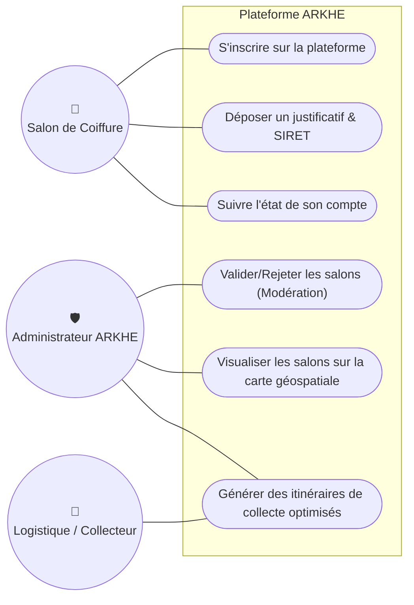
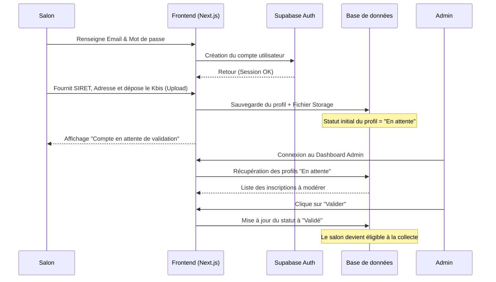
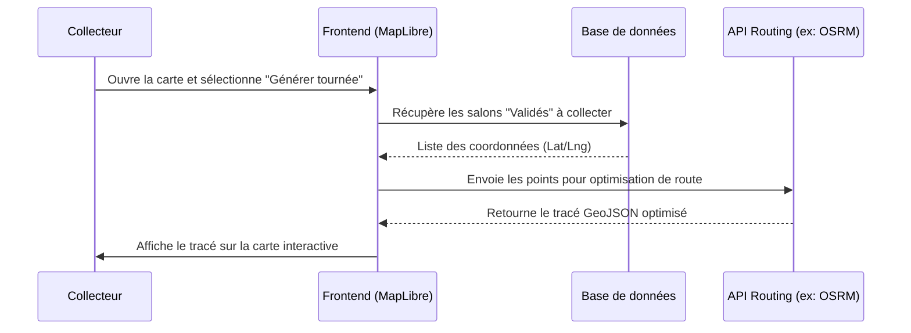
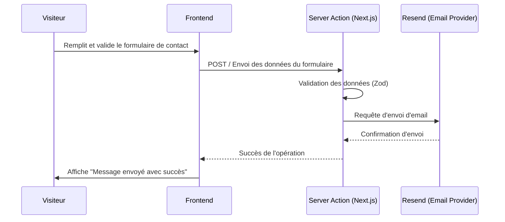

# ARKHE - Plateforme B2B d'Économie Circulaire

ARKHE est une plateforme B2B innovante spécialisée dans la valorisation des déchets, connectant spécifiquement les salons de coiffure avec des laboratoires et entreprises pour le recyclage des cheveux.

---

## 🚀 Fonctionnalités Principales

### 🏢 Espace Salons de Coiffure (B2B)
- **Authentification & Onboarding** : Système d'inscription complet et sécurisé.
- **Validation Automatique SIRET** : Vérification instantanée de l'existence légale de l'entreprise via l'API publique "Recherche Entreprises".
- **Dépôt de Justificatifs** : Upload de documents officiels (Kbis, Bail commercial) de manière sécurisée (Stockage protégé par RLS).
- **Suivi de Compte** : Visualisation du statut de validation de leur compte (En attente, Validé, Rejeté).

### 🛡️ Dashboard Administrateur
- **Modération des Inscriptions** : Interface dédiée pour examiner, valider ou rejeter les demandes d'inscription des salons.
- **Gestion des Profils** : Vue d'ensemble sur tous les utilisateurs inscrits sur la plateforme (Salons, Collecteurs, Administrateurs).
- **Contrôle d'Accès** : Système de rôles limitant l'accès aux fonctionnalités sensibles.

### 🗺️ Cartographie & Logistique
- **Interface Interactive PWA** : Application web progressive fonctionnant sur Mobile et Desktop, avec support hors-ligne de base.
- **Visualisation Géospatiale** : Carte basée sur **MapLibre GL** affichant l'ensemble des salons partenaires (validés) avec des marqueurs interactifs.
- **Planification des Tournées** : Génération et optimisation des itinéraires de collecte pour les chauffeurs / logisticiens.

### ✉️ Communication & Légal
- **Formulaire de Contact** : Intégration d'un système d'envoi d'emails transactionnels fiables via **Resend**.
- **Conformité RGPD** : Pages dédiées pour les Mentions Légales et la Politique de Confidentialité, gestion du consentement, absence de cookies tiers intrusifs.

---

## 🛠️ Stack Technique

- **Framework** : [Next.js 14](https://nextjs.org/) (App Router)
- **Langage** : TypeScript
- **Styling** : [Tailwind CSS](https://tailwindcss.com/)
- **Backend & Base de données** : [Supabase](https://supabase.com/) (PostgreSQL, Auth, Storage)
- **Cartographie** : [MapLibre GL JS](https://maplibre.org/)
- **Emails** : [Resend](https://resend.com/)
- **PWA** : Serwist

---

## 📊 Architecture & Modélisation

### 1. Diagramme de Cas d'Utilisation (Use Case)



### 2. Diagramme de Séquence : Flux d'Inscription & Modération



### 3. Diagramme de Séquence : Génération d'Itinéraire de Collecte



### 4. Diagramme de Séquence : Formulaire de Contact



---

## 🗄️ Schéma de la Base de Données

Le backend s'appuie sur la base **PostgreSQL** hébergée via **Supabase**. L'authentification est gérée nativement par `auth.users`. Les informations métier sont stockées dans une table personnalisée (ex: `salons` ou `profiles`).

### Table Principale : `salons` (ou `profiles`)

| Nom de la Colonne        | Type de Donnée     | Description |
|--------------------------|--------------------|-------------|
| `id`                     | `UUID` (PK, FK)    | Identifiant unique (lié à `auth.users.id`). |
| `email`                  | `TEXT`             | Adresse email du contact principal. |
| `role`                   | `VARCHAR`          | Rôle de l'utilisateur (`admin`, `user`). |
| `nom_commerce`           | `TEXT`             | Nom du salon ou de la structure. |
| `siret`                  | `TEXT`             | Numéro de SIRET à 14 chiffres. |
| `adresse`                | `TEXT`             | Adresse postale complète. |
| `latitude`               | `FLOAT8`           | Coordonnée X pour le placement sur la carte. |
| `longitude`              | `FLOAT8`           | Coordonnée Y pour le placement sur la carte. |
| `url_justificatif_local` | `TEXT`             | Chemin d'accès au document justificatif dans le Storage. |
| `status`                 | `VARCHAR`          | État de l'inscription (`pending`, `approved`, `rejected`). |
| `created_at`             | `TIMESTAMPTZ`      | Date et heure de création de l'enregistrement. |

### Supabase Storage (Buckets)

- **Bucket `justificatifs`** : Stocke les documents administratifs uploadés par les salons (Kbis, Bail). L'accès à ce bucket est soumis à des règles RLS pour garantir la confidentialité des documents.

---

## 📂 Structure du Projet

```text
src/
├── actions/             # Server Actions (Auth, Contact, etc.)
├── app/                 # Routes Next.js (App Router)
│   ├── (admin)/         # Espace administrateur protégé (Dashboard, Map, Modération)
│   ├── (auth)/          # Routes d'authentification (login, register/onboarding)
│   ├── contact/         # Page de contact
│   ├── mentions-legales/ # Mentions Légales
│   └── politique-de-confidentialite/ # Politique de confidentialité
├── components/          # Composants UI réutilisables
│   ├── icons/           # SVGs
│   ├── inputs/          # Composants de formulaires (EmailInput, SiretInput, DocumentUpload, etc.)
│   ├── layout/          # Headers, Footers, Sidebars Administrateur
│   ├── map/             # Composants liés à la cartographie MapLibre (DesktopSidebar, CollectPopup)
│   └── ui/              # Composants génériques (Button, Modal, etc.)
├── middleware.ts        # Middleware Supabase pour la protection des routes (SSR Auth)
```

---

## ⚙️ Prérequis

- **Node.js** (v18.x ou supérieur)
- **NPM**, **Yarn** ou **pnpm**
- Un projet **Supabase** configuré (Database, Auth, Storage)
- Une clé API **Resend** (pour l'envoi d'emails)

---

## 📦 Installation & Déploiement Local

1. **Cloner le dépôt**
   ```bash
   git clone <url-du-repo>
   cd arkhe
   ```

2. **Installer les dépendances**
   ```bash
   npm install
   ```

3. **Variables d'Environnement**
   Créez un fichier `.env.local` à la racine du projet et ajoutez vos clés :
   ```env
   NEXT_PUBLIC_SUPABASE_URL=your_supabase_project_url
   NEXT_PUBLIC_SUPABASE_ANON_KEY=your_supabase_anon_key
   RESEND_API_KEY=your_resend_api_key
   ```

4. **Lancer le serveur de développement**
   ```bash
   npm run dev
   ```
   L'application sera accessible sur `http://localhost:3000`.

---

## 🔒 Sécurité & RGPD

- **Row Level Security (RLS)** : Activé sur Supabase pour garantir que les utilisateurs finaux ne peuvent lire/modifier que leurs propres données. Les administrateurs disposent de privilèges étendus gérés par politique.
- **Aucun Cookie Tiers** : L'application n'utilise pas de traceurs publicitaires. Seuls les cookies de session nécessaires (Supabase Auth) sont déployés, exemptés de bannière de consentement.
- **Droit à l'oubli** : Mise à disposition d'une page de confidentialité détaillant la procédure de suppression de compte et des fichiers déposés.

---

## 📱 Progressive Web App (PWA)

Ce projet est configuré comme une **PWA** via `Serwist`. Il peut être installé sur les appareils mobiles (iOS/Android) pour une expérience quasi-native. Le mode hors-ligne et le cache statique facilitent l'utilisation de l'interface cartographique par les collecteurs sur le terrain.

---

## 🤝 Contribution

1. Créez une nouvelle branche pour votre fonctionnalité (`git checkout -b feature/ma-super-feature`).
2. Les messages de commit doivent respecter les conventions *Conventional Commits* (`feat:`, `fix:`, `style:`, `refactor:`).
3. Vérifiez le typage et le linting avant de soumettre une Pull Request (`npm run lint`).